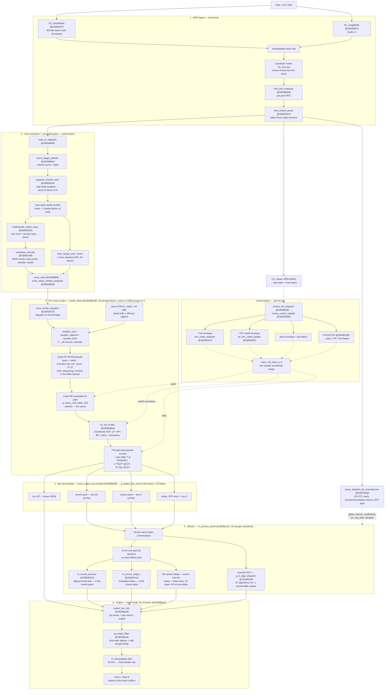

# The Route of the Sound — MIDI in → audio out in SCCore.dll

How a MIDI event becomes sound in the Sound Canvas VA tone-generator core, end to end.
Everything here is condensed from the reverse-engineering evidence in
[`FINDINGS.md`](FINDINGS.md) and the recovered symbol map in [`SYMBOLS.md`](SYMBOLS.md)
(names are project labels, not Roland's; addresses are virtual, image base `0x180000000`).
Confidence tags in FINDINGS.md apply; this document only restates `[confirmed]` /
strongly-`[likely]` structure.

## The four clock domains

The route crosses four time bases, and most of the architecture falls out of them:

| Domain | Rate | What runs there |
|---|---|---|
| Event time | timestamped, sample-accurate | MIDI ingest, queues, parser, SysEx |
| Control tick | **100 Hz** (every 320 internal samples = 10 render blocks) | envelopes, LFOs, mod matrix, pitch/TVF/TVA updates |
| Audio block | **32 000 Hz** internal, 32-sample blocks | samplers, filters, bus mix, effects |
| Host rate | whatever `TG_setSampleRate` says | 2× interpolating SRC on the way out |

The internal engine always renders at 32 kHz (the hardware's rate); the host block
(`TG_Process(left, right, count)`) is produced by sample-rate conversion at the very end.

## The chart

Solid arrows are the audio/event path; dotted arrows are control-rate parameter flow.

## Stage by stage

### 1 · MIDI ingest

`TG_ShortMidiIn` does no synthesis — it decodes the status byte into an internal event
class, timestamps it, and enqueues it into an input ring. Each `TG_Process` call moves
the events whose timestamps fall inside the current block into a "ready" buffer
(`TG_flushMidi` does the same unconditionally), drains them to per-port FIFOs
(`midi_drain_ready_to_ports` → `midi_port_enqueue`), and a table-driven parser state
machine reassembles channel-voice messages. This is the queue → scheduler → FIFO → parser
shape of a hardware unit servicing a UART, carried over intact.

From the parser, events fork three ways: note-on/off into the voice allocator, channel
controllers (CC, bend, aftertouch, RPN/NRPN) into part state and the mod matrix, and
SysEx into the GS DT1/RQ1 handlers (which also select reverb/chorus/delay macros and the
insertion-EFX type — i.e. SysEx configures stage 5).

### 2 · Tone resolution and voice allocation

A note-on resolves `(map, bank, program)` through a 3-level LUT to a tone number —
vintage-selectable per SC-55/88/88Pro/8820 map. The tone record (ASCII name + up to two
partial parameter blocks of 0x6e bytes) drives everything downstream: each partial picks
its multisample, the multisample's key zones and velocity layers pick a wave number, and
the wave descriptor yields ROM coordinates, loop points, root key, and the sampler
variant (forward-loop, ping-pong, one-shot, reverse). Polyphony is 64 voices with an LRU
note-group list and voice stealing. `voice_start` populates the per-voice
structure-of-arrays state and `voice_setup_sample_playback` computes the wave-ROM address
(two banks, 1 MB key regions). Drums bypass the melodic LUT via a static note-indexed kit
table (tone#, level, coarse pitch at half strength, mute group, pan, sends per key).

### 3 · Per-voice render

`render_block` processes the 64 voices in groups of 4 (the SoA layout is SIMD-shaped).
Per voice, per 32-sample block:

1. **Sampler** — `voice_render_dispatch` picks one of six samplers. The wave data is
   block-floating-point DPCM: one signed delta byte per sample plus a shift-exponent
   nibble per 16-sample block, integrated into a predictor (`pred += delta·2^(scale+10)`,
   normalized by `2^-27`). Looping rewinds the delta index and keeps the predictor —
   loops, ping-pong, and reverse playback all happen in the delta domain, seamlessly.
2. **Pitch** — a 4-tap FIR resampler against a 128-phase coefficient table
   (`g_interp_coef_table`) retunes the wave. This interpolator is the single most
   timbre-defining element of the engine.
3. **Filter (TVF)** — a Chamberlin state-variable filter with per-partial type
   (LP/HP/BP/notch/bypass), cutoff `Fc = 10591·2^((C−245760)/14175)` Hz, resonance from
   `block[0x30]`.
4. **Amp (TVA) + pan** — log-domain level curves, then the exact 128-entry pan table
   (`L = T[127−p]/127`, `R = T[p−1]/127`; center = 75/127).

All the *movement* — envelopes (16-bit phase-accumulator segments, `t = 0x10000/rate ×
10 ms`), the two LFO engines, the mod matrix (CC1, bend, aftertouch) — runs on the
100 Hz control tick and is smoothed to per-sample values by the `voice_ctrl_ramp_a–d`
ramps before it touches pitch, cutoff, or gain.

### 4–5 · Buses and effects

Each voice MACs its output into a 64-bus accumulator: dry L/R (buses 58/59) plus
per-voice send levels into the reverb (bus 60), chorus (bus 3), and delay/EFX (bus 2)
buses. `fx_process_block` then runs a 33-bus send matrix and, in 32-sample sub-blocks,
the effect processors — each behind its own 20 Hz one-pole DC blocker (a hardware-era
necessity: the DPCM predictor drifts). Reverb is an allpass/comb tank whose 8 GS types
are coefficient sets over one topology; chorus is a modulated delay line (8 types); the
GS system delay is a third send effect woven directly into the matrix (10 types, with a
fixed 60 ms input pre-delay). Insertion EFX is a function-pointer table of 67 distinct
algorithm processors selected by a type→index map — including dispatch slot 66, a
complete modulated multi-tap delay that nothing can select (see
[`PROVENANCE.md`](PROVENANCE.md) on why that orphan matters).

### 6 · Output

`output_bus_mix` sums the dry buses and wet returns into the output pair,
`tg_output_filter` (a first-order allpass acting as a half-sample delay) feeds the 2×
interpolating sample-rate converter, and `TG_Process` writes the final `float` L/R
blocks into the host's buffers. That SRC is the only place the host sample rate exists;
everything upstream is the 32 kHz hardware engine.

## Caveats

- Which of the four `voice_ctrl_ramp_*` functions drives pitch vs amp vs filter is
  inferred from pipeline position, not individually pinned (`[likely]`).
- The dry path shows measurably zero DC in real renders, but no DC blocker was found on
  it — the three blocker instances all sit on effect inputs. Placement of the dry-path
  DC removal is an open question (host wrapper, mis-decompiled region, or misread
  routing).
- Insertion-EFX internal routing (which parts feed it, dry/wet within the block) is the
  least-traced link in the chart; the algorithms themselves are identified and named but
  not individually analyzed.
- Bus numbering (58/59 dry, 60 reverb, 3 chorus, 2 delay/EFX) comes from the DC-blocker
  and accumulator analysis; treat individual bus indices as evidence-backed labels, not
  a verified full bus map.
